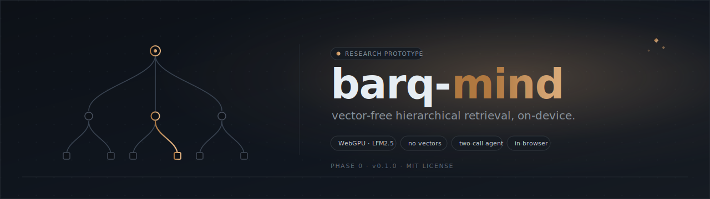

<p align="center">
  
</p>

<h1 align="center">barq-mind</h1>

<p align="center">
  <em>A vector-free, hierarchical, LLM-navigated retrieval database that runs entirely in your browser.</em>
</p>

<p align="center">
  <a href="#"></a>
  <a href="#"></a>
  <a href="#"></a>
  <a href="#"></a>
  <a href="#"></a>
  <a href="LICENSE"></a>
</p>

---

## Overview

**barq-mind** is a research prototype that tests a single, sharp thesis: high-quality retrieval over long documents does not require dense vector embeddings. Instead of indexing chunks in a vector store and searching by cosine similarity, barq-mind constructs a structural tree of LLM-written summaries (one short routing line and one paragraph per node) and lets a small on-device language model navigate that tree two calls at a time.

The entire stack runs inside a browser tab. WebGPU drives inference using **LFM2.5-1.2B-Instruct** (Liquid AI, ~700 MB q4-quantized). The Origin Private File System stores the corpus, raw text, and summary cache. A tiny BM25 index handles fallback when the navigator cannot find a path. There is no server, no API key, and no embedding model anywhere in the pipeline.

The repository ships **v0.1.0** of the prototype: 17 phases of incremental, fully tested work. If the validation holds, the core moves to a Rust port. If it does not, this codebase is the artifact that explains why.

---

## Highlights

- **Zero vectors.** Retrieval is driven entirely by hierarchical summaries and structured navigation actions, not similarity scores.
- **Two-call execution model.** One LLM call picks the path, a second LLM call answers from raw spans. The two are never collapsed.
- **Runs locally.** WebGPU + ONNX Runtime Web. No cloud, no API token, no telemetry.
- **Persistent.** OPFS keeps the corpus, raw text, summary cache, and BM25 index across reloads.
- **Explainable.** Every navigation step emits a structured trace event that the UI surfaces as a clickable path in the tree view.
- **Build-free.** Plain ES modules over an import map. Clone, serve the directory, open the page.
- **Tested.** A purpose-built micro test harness covers storage, tree, chunker, ingest, prompts, builder, navigator, synthesizer, and BM25.

---

## Architecture at a glance

```
                          Query
                            │
                            ▼
        ┌─────────────────────────────────────┐
        │  Phase 1: Navigate (LLM call)       │
        │  Tree of NodeRecord summaries       │
        │  → selected leaf node IDs           │
        └─────────────────────────────────────┘
                            │
                            ▼
        ┌─────────────────────────────────────┐
        │  Phase 2: Synthesize (LLM call)     │
        │  Raw text spans for selected leaves │
        │  → answer + citations               │
        └─────────────────────────────────────┘
```

For the full design, see [`docs/ARCHITECTURE.md`](docs/ARCHITECTURE.md). Prompt contracts live in [`docs/PROMPTS.md`](docs/PROMPTS.md). The evaluation methodology is in [`docs/EVAL.md`](docs/EVAL.md).

---

## Requirements

- A WebGPU-capable browser:
  - Chrome 113+, Edge 113+, or any Chromium build with WebGPU enabled
  - Safari Technology Preview 18+ on macOS
- A discrete or integrated GPU (most laptops from 2020 onward qualify)
- Roughly **1.5 GB of free disk** for the model cache (managed by the browser)
- A static file server. The page **must** be served over `http://localhost` or HTTPS — WebGPU and OPFS will not work from `file://`

---

## Quick start

```bash
git clone https://github.com/YASSERRMD/barq-mind.git
cd barq-mind
```

Then start any static file server in the project directory and open `http://localhost:<port>` in a supported browser.

### Pick any one of these

| Tool | Command |
|------|---------|
| **Node.js** (recommended, no install) | `npx serve . -l 8080` |
| **Bun** | `bunx serve . -l 8080` |
| **Python 3** | `python3 -m http.server 8080` |
| **Python 2** | `python -m SimpleHTTPServer 8080` |
| **PHP** | `php -S localhost:8080` |
| **Ruby** | `ruby -run -e httpd . -p 8080` |
| **Go** | `go run github.com/m3ng9i/ran@latest -p 8080` |
| **Deno** | `deno run --allow-net --allow-read jsr:@std/http/file-server --port 8080` |
| **caddy** | `caddy file-server --listen :8080` |
| **VS Code** | install *Live Server*, right-click `index.html` → *Open with Live Server* |
| **JetBrains** | right-click `index.html` → *Open in Browser* |

> Any HTTP server that streams static files works. The repository contains no build step, no bundler, and no transpilation; the browser loads ES modules directly.

### First-run walkthrough

1. **Load Model.** First run downloads ~700 MB; later runs are seconds.
2. **Sample.** Loads `samples/carbon-policy.md`, a synthetic policy brief, and triggers tree summarization.
3. **Ask.** Try *"What is the implementation timeline?"* or *"How does the brief address economic risk?"*
4. **Trace.** Toggle *show trace* in the toolbar to inspect the navigation path step by step.

Drag-and-drop also works for `.md`, `.txt`, `.pdf`, and `.json` (corpus exports).

---

## Repository layout

```
src/
  app.js            UI controller for index.html
  db.js             Corpus + CognitiveDB facade
  storage.js        OPFS wrapper, scoped per corpus
  tree.js           NodeRecord factory, Tree class, content hashing
  builder.js        Bottom-up summarization with hash-keyed cache
  chunker.js        Markdown / sentence-aware / paged chunkers
  ingest.js         Markdown / plain text / paged / PDF dispatch
  inference.js      WebGPU loader for LFM2.5 + chat / chatStream
  navigator.js      Phase-1 navigation call
  synthesizer.js    Phase-2 synthesis call
  bm25.js           MiniSearch fallback index
  prompts.js        All prompt templates
  pdf-loader.js     pdf.js text extraction
  eval.js           Evaluation harness
  profiler.js       Span-based performance instrumentation
  ui/
    stats.js
    doc-list.js
    conversation.js
    tree-view.js
samples/
  carbon-policy.md  Synthetic test corpus
  eval-set.json     17 hand-authored evaluation questions
docs/
  ARCHITECTURE.md
  PROMPTS.md
  EVAL.md
  assets/banner.svg
tests/
  runner.js         50-line in-house test harness
  test-*.js         per-module suites
index.html          App entry
tests.html          Test runner page
```

---

## Tech stack

- **Language:** Vanilla JavaScript ES modules. No build step, no bundler, no transpilation.
- **Inference:** [Transformers.js v3](https://github.com/huggingface/transformers.js) on top of ONNX Runtime Web (WebGPU backend).
- **Model:** [LFM2.5-1.2B-Instruct-ONNX](https://huggingface.co/LiquidAI/LFM2.5-1.2B-Instruct-ONNX) (Liquid AI, q4 quantization).
- **Storage:** Origin Private File System (OPFS) async API.
- **Keyword fallback:** [MiniSearch](https://github.com/lucaong/minisearch) (BM25).
- **PDF ingestion:** [pdf.js](https://mozilla.github.io/pdf.js/) v4.0.379 via cdnjs.

---

## Documentation

| Document | Description |
|----------|-------------|
| [`docs/ARCHITECTURE.md`](docs/ARCHITECTURE.md) | Vector-free thesis, two-call execution model, NodeRecord schema, action schema, file map, performance numbers. |
| [`docs/PROMPTS.md`](docs/PROMPTS.md) | Catalog of every LLM prompt template, its inputs, and its expected output shape. |
| [`docs/EVAL.md`](docs/EVAL.md) | Evaluation methodology, eval-item schema, BM25 baseline rule, how to add new questions. |
| [`samples/README.md`](samples/README.md) | Synthetic corpus and evaluation-set reference. |

---

## Roadmap

**v0.1.0 (this release)** — phases 0 through 16:

- [x] OPFS storage wrapper
- [x] Canonical tree data structures
- [x] Structural and sentence-aware chunkers
- [x] Markdown, plain text, paged, and PDF ingestion
- [x] WebGPU inference engine
- [x] Centralized prompt templates
- [x] Bottom-up tree summarization with content-hash cache
- [x] CognitiveDB facade
- [x] Two-call navigator and synthesizer
- [x] BM25 fallback index
- [x] UI shell with conversation, tree view, and trace panel
- [x] Evaluation harness with BM25 baseline comparator
- [x] Architecture, prompt, and evaluation documentation
- [x] Profiling and optimization pass

**Beyond v0.1.0:**

- Vision-native ingestion (page rasterization plus a visual LLM tree builder)
- LATTICE-style calibrated path relevance
- GraphRAG-style hierarchical community detection
- A Rust core port (the long-term destination)

---

## Foundations

barq-mind is influenced by, but does not directly implement, the following lines of work:

- **RAPTOR** — Recursive Abstractive Processing for Tree-Organized Retrieval (Sarthi et al., 2024)
- **MemWalker** — Walking Down the Memory Maze (Chen et al., 2023)
- **GraphRAG** — Microsoft Research, 2024
- **LATTICE** — calibrated path relevance, 2024
- **PageIndex** — TIFIN, 2024
- Andrej Karpathy's *LLM Wiki* thread, 2024

---

## Contributing

This is a research prototype, not a production library. Issues, design notes, and reproducible bug reports are welcome. Pull requests should follow the existing phase / atomic-commit convention and include tests where applicable.

---

## License

Released under the [MIT License](LICENSE).
