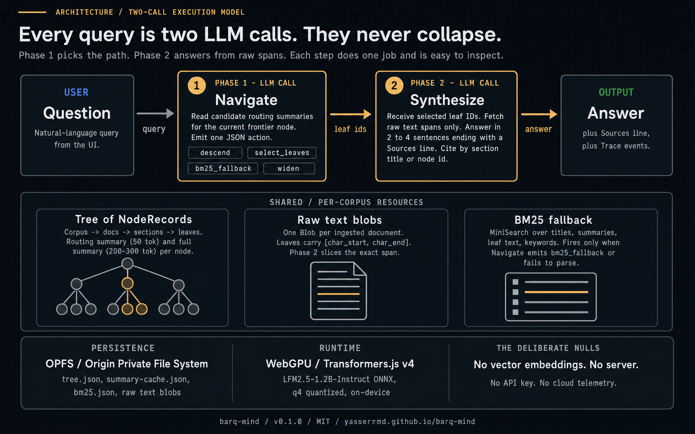

# barq-mind Architecture

barq-mind is a research prototype that retrieves information from long documents without using vector embeddings. It runs entirely in the browser, with WebGPU inference, OPFS persistence, and a hierarchical tree of LLM-generated summaries as the only retrieval signal.

This document is the canonical reference for the prototype's design. It is intentionally short.

## The vector-free thesis

Most modern retrieval systems start by asking "what passages are similar to this query?" and answer with a dense vector cosine. That works, but it costs an embedding model, an index, and a never-ending battle against semantic drift between query and chunk.

barq-mind tests a different premise: an LLM is good enough at reading a table of contents to navigate to the right passage on its own. If you give the model a structural tree (document → sections → paragraphs) annotated with one-line and one-paragraph summaries, it will descend to the relevant leaves with high precision. No embeddings, no similarity scores, no drift.

The thesis: high-quality retrieval over long documents requires structure, not vectors. The prototype validates this on a synthetic corpus and an in-browser model. The Rust core port comes later if the validation holds.

## The two-call execution model

Every query runs two LLM calls in sequence:

1. **Navigate** (`src/navigator.js`). Given the query, the current node, and the candidate children, the model emits a JSON action: descend, select_leaves, bm25_fallback, or widen. The Navigator parses, validates against candidate IDs, and walks the tree to a frontier of selected leaves.
2. **Synthesize** (`src/synthesizer.js`). The Synthesizer fetches the raw text spans for each selected leaf and prompts the model to answer using ONLY those excerpts, ending with a Sources line. Citations are parsed back out.

The two calls are never collapsed. Navigation cannot hallucinate the answer because it has no excerpts. Synthesis cannot hallucinate the path because it has no children. Each step does one job and is easy to inspect.

<p align="center">
  
</p>

When the navigator emits `bm25_fallback` (or fails to parse twice), the Navigator returns query terms and CognitiveDB consults the BM25 index over leaf text and summaries before invoking the synthesizer. The synthesis prompt is identical; only the leaf source changes.

## Canonical NodeRecord schema

Every node in the tree, regardless of level, conforms to:

```typescript
type NodeRecord = {
  node_id: string;                  // "doc:<doc>/sec:1.2" or "doc:<doc>/leaf:42"
  doc_id: string;
  parent_id: string | null;
  title: string;
  level: "corpus" | "document" | "section" | "subsection" | "page" | "leaf";
  routing_summary: string;          // ~50 tokens, used during navigation
  summary: string;                  // 200-300 tokens, used by retry/widen logic
  child_ids: string[];
  span: [number, number] | null;    // char offsets for leaves
  page_start: number | null;
  page_end: number | null;
  keywords: string[];
  is_leaf: boolean;
  created_at: number;
  source_hash: string;              // sha256, drives the summary cache
};
```

The schema is invariant across phases and enforced by `makeNode` in `src/tree.js`.

## Action schema

Navigation always emits one of these JSON shapes:

```json
{ "action": "descend",        "child_ids":   ["..."], "reason": "..." }
{ "action": "select_leaves",  "leaf_ids":    ["..."], "reason": "..." }
{ "action": "bm25_fallback",  "query_terms": ["..."], "reason": "..." }
{ "action": "widen",                                  "reason": "..." }
```

`parseAction` strips fences, walks balanced braces, and validates against the candidate list. Phantom IDs trigger one retry; second failure converts to `bm25_fallback` with a naive query-term split.

## File layout

```
src/
  app.js          UI controller for index.html
  db.js           Corpus + CognitiveDB facade
  storage.js      OPFS wrapper (per-corpus)
  tree.js         NodeRecord factory, Tree class, sha256
  builder.js      Bottom-up summarization with content-hash cache
  chunker.js      Markdown structural chunker, sentence splitter, page-aware
  ingest.js       Markdown / plain text / paged / PDF dispatch
  inference.js    WebGPU loader for LFM2.5 + chat/chatStream
  navigator.js    Phase-1 navigation call
  synthesizer.js  Phase-2 synthesis call
  bm25.js         MiniSearch fallback index
  prompts.js      All prompt templates
  pdf-loader.js   pdf.js text extraction
  eval.js         Evaluation harness
  ui/
    stats.js
    doc-list.js
    conversation.js
    tree-view.js
```

Each module is small (often under 200 lines). The largest by responsibility is `db.js`, which is the single point of contact between the UI and the engine.

## Performance characteristics

Measured informally on an M2 MacBook Pro (8-core GPU) with the carbon-policy sample (~30 nodes, ~17 leaves):

| Phase | Time |
|-------|------|
| Model load (cached) | 4 to 8 seconds |
| Markdown ingest (no summarization) | under 100 ms |
| Summarization pass (full tree, cold cache) | 60 to 120 seconds |
| Subsequent summarization (warm cache) | under 1 second (no LLM calls) |
| Navigation depth-3 + synthesis | 3 to 6 seconds |
| BM25 fallback + synthesis | 2 to 4 seconds |

The summarization pass is the only really expensive operation, and it is amortized across every future query.

## Out of scope for v0.1.0

- Concurrent ingest or query (single context at a time)
- Multi-corpus support beyond one per origin
- Vision-native ingestion (page rasterization plus visual LLM)
- LATTICE-style calibrated relevance scoring
- GraphRAG-style community detection
- Vector embeddings of any kind (deliberate)
- Mobile browser support
